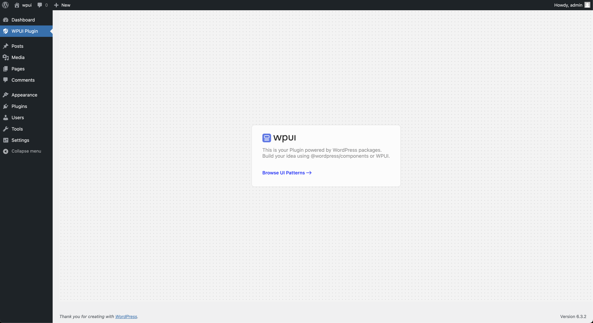

# WPUI Sample Plugin
### Build Your React Powered WordPress Plugin With Speed.
WPUI is a design pattern library built upon wordpress components Which gives you the building blocks you need to build your react-powered WordPress plugin. spend less time on UI and more time building your idea. This sample plugin provides you with starting point to get things started.

## Usage
- Clone `git clone git@github.com:lubusIN/wpui-sample-plugin.git my-plugin` in you WordPress plugins directory
- Open plugin directory `cd my-plugin`
- Changes plugin as required

## Development 
- Install dependencies `npm install`
- Watch for chanegs in dev `npm run start`
- Build production assets `npm run build`

## Meet Your Artisans

[LUBUS](http://lubus.in) is a web design agency based in Mumbai.

## License

`WPUI Sample Plugin` is an open-source software licensed under the [MIT](LICENSE)
